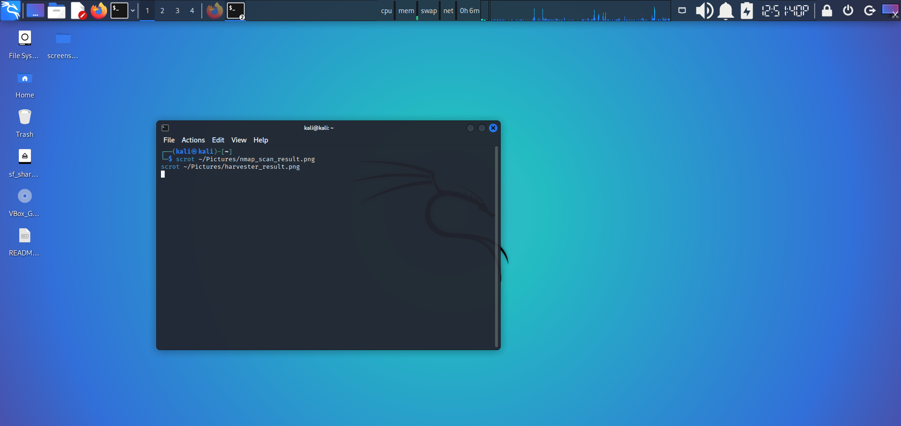
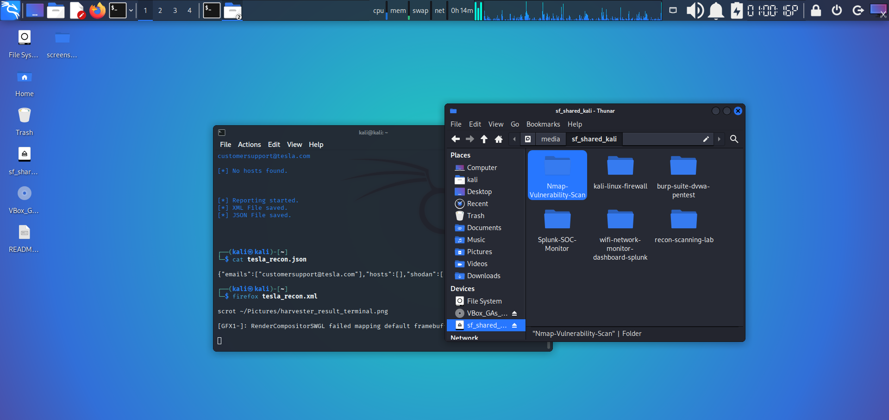
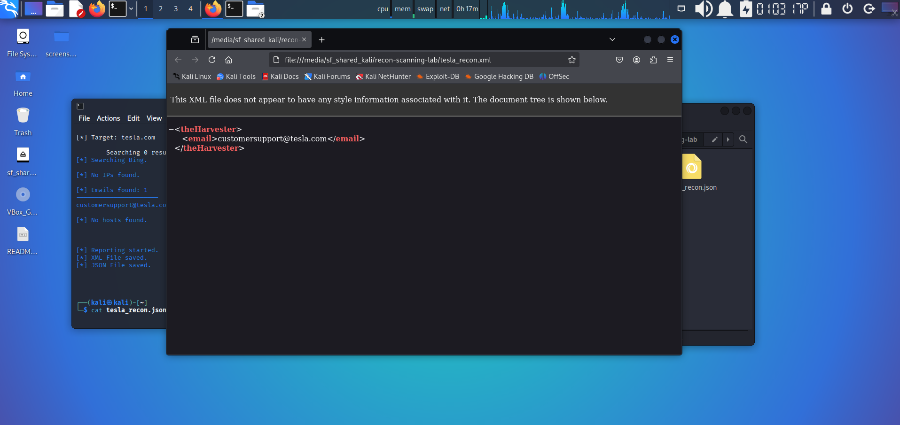

# 🔍 Cyber Reconnaissance & Scanning Lab (Security+ Aligned)

> Hands-on project simulating real-world network and open-source intelligence (OSINT) reconnaissance — aligned with CompTIA Security+ Domain 1 (Threats, Attacks & Vulnerabilities).  
> Built entirely on **Kali Linux** using professional-grade tools. ✅

---

## 🧠 What I Did

1. 🔎 Scanned my Kali VM’s local IP using **Nmap** to detect open ports, services, and OS fingerprints.
2. 🌐 Ran **theHarvester** against a public domain (`tesla.com`) to collect emails, hosts, and IPs from Bing.
3. 📸 Documented and stored every result — both terminal output and screenshots — to simulate real-life SOC reporting.

---

## 🛠️ Tools Used

| Tool          | Purpose                         |
|---------------|----------------------------------|
| `nmap`        | Network port & service scanning |
| `theHarvester`| OSINT collection (emails, subdomains) |
| `scrot`       | Screenshot capture |
| `firefox`     | Report viewing |
| `net-tools`   | IP verification (`ip a`) |

---

## 🔐 Key Learning Outcomes

- Identified TCP services running on a local Kali system.
- Explored open-source intelligence tools to simulate threat actor recon.
- Understood how Blue Teams can detect early scanning activities.

---

## 🗂️ Project Files

| File                          | Description                        |
|-------------------------------|------------------------------------|
| `recon_scan.txt`              | Full Nmap output of local scan     |
| `tesla_recon.json / xml`      | theHarvester results (optional)    |
| `screenshots/*.png`           | Captured proof of tools in action  |
| `tool_versions.txt`           | Versions of tools used             |
| `terminal_info.txt`           | Local IP and interface snapshot    |

---

## 📸 Screenshots

> 
>  
> 
>
> 

---

## 💼 Why This Project?

This project mimics the **early phases of the Cyber Kill Chain** (Reconnaissance), a core concept in Security+ and real-world SOC environments.  
It also reflects how attackers gather information — and how defenders can spot them early.

---

## 🔗 Connect With Me

📍 Mohith Vasamsetti  
📬 [LinkedIn](https://www.linkedin.com/in/mohithvasamsetti5666)  
🧠 Currently preparing for **CompTIA Security+**

---

